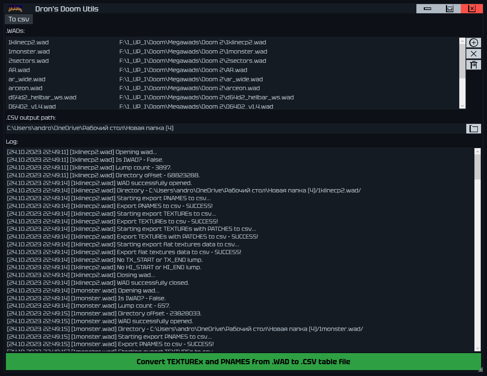

# Dron's Doom Utils

# STATUS: 📦EARLY RELEASE

This is a program that I developed to solve and automate some tasks related to modding and mapping for doom.

This program is written in a hurry and should not be taken as a programming master code.

In the future the code will most likely be subject to refactoring and optimization, and most likely I will add new functionality to the application.

List of features in the current version:
- Ability to export information from TEXTUREx and PNAMES of wad to csv format tables
- Added .wad multi-loading
- Flat textures data export
- Export of TX_ texture information to CSV has been implemented
- Export of HI_ texture information to CSV has been implemented

### Download - [Latest Release - v0.2](https://github.com/dron12261games/SFT-DronsDoomUtils/releases/download/v0.2/Drons.Doom.Utils.v0.2.zip)

### Requires [.NET 6.0 Runtime](https://dotnet.microsoft.com/en-us/download/dotnet/6.0)

# Screenshots:

